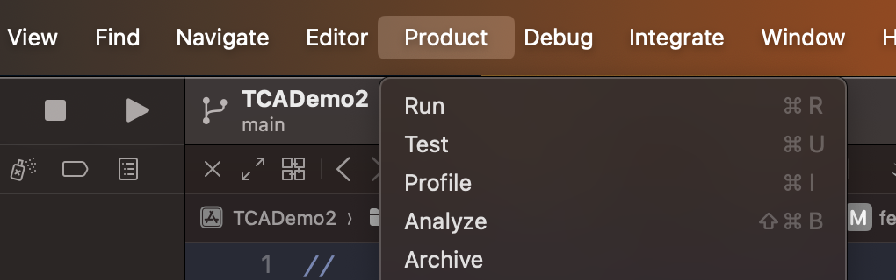
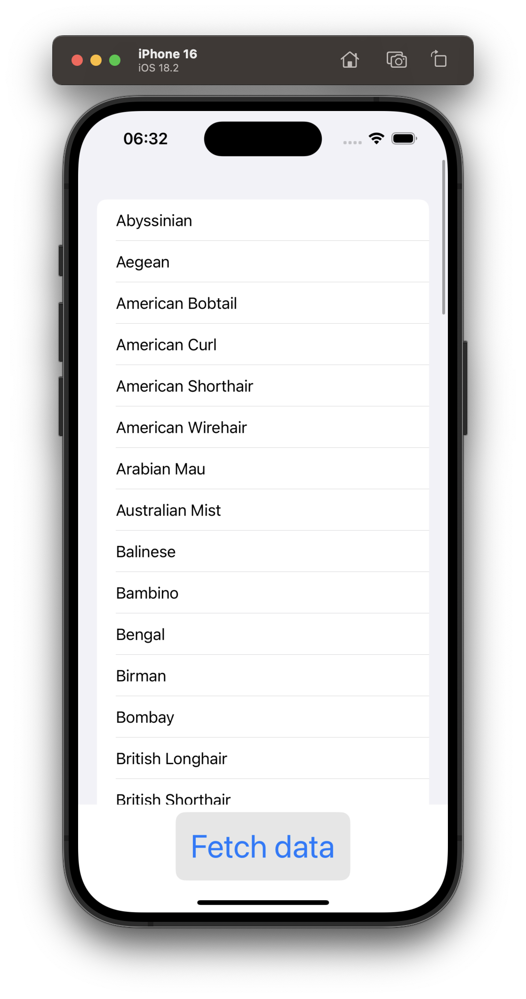

# tca-demo-ios
Demo app for learning TCA architecture on iOS

https://github.com/pointfreeco/swift-composable-architecture

## Environment
- Xcode 16.1
- macOS Sequoia 15.2

## Usage

### Running the app
Note. Select TCADemo2 in schemes dropdown

- Xcode > Product > Run

### Running unit tests

TODO add unit tests
- Xcode > Product > Test

## Screenshots

## TODO
- [x] API requests
- [ ] Navigation
- [ ] Tests
